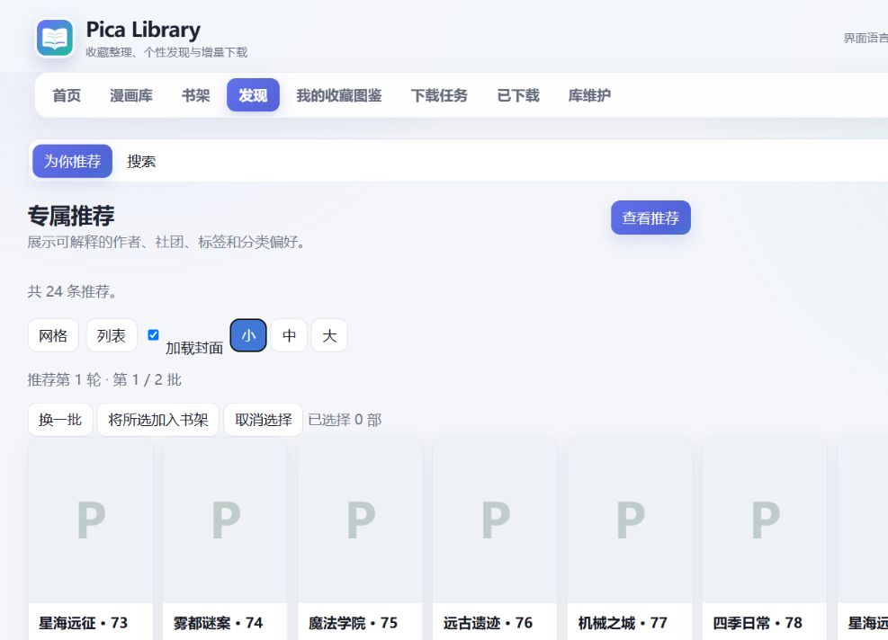
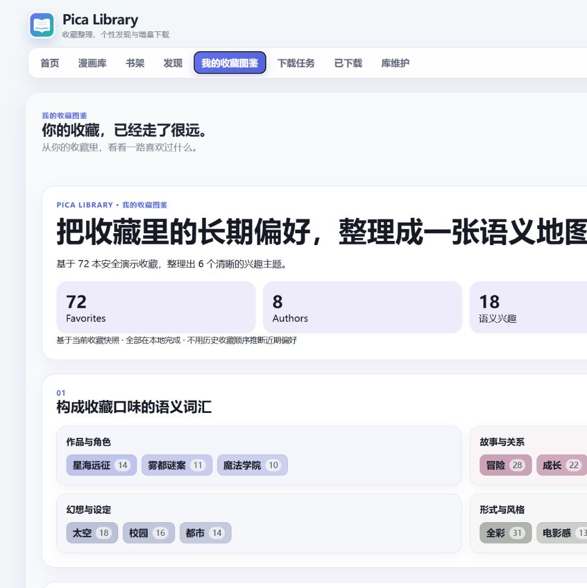

简体中文 | [English](README.en.md)

# Pica Library

面向大量 Pica 收藏的本地漫画库：同步、整理、发现、下载和阅读，全部在自己的电脑上完成。

适用于 Windows 10/11 x64。无需安装 Node.js、Git，也无需使用命令行。

它把收藏、搜索结果、推荐和下载状态放进同一个持续维护的本地资料库，而不是每次下载都从头开始。长期连载可以检查新章节，作者名称可以统一整理，推荐结果也会说明它与现有收藏的联系。普通用户只需要解压并双击启动；需要更细控制时，仍可查看任务、文件和维护状态。

<!-- CAPTION_PENDING -->

## 开始使用

1. 打开 [GitHub Releases](https://github.com/Saber-Alter-Lily/pica-library/releases)。
2. 下载 `Pica-Library-v0.3.0-windows-x64.zip`。
3. 完整解压 ZIP，不要直接在压缩软件中运行。
4. 双击 `Pica Library.exe`。
5. 按首次设置完成账号、可选代理和保存目录配置，然后同步收藏。

详细步骤见 [中文快速开始](docs/quick-start.zh-CN.md)。

## 能做什么

- **收藏管理：**同步长期收藏，按作者、标签、分类和书架快速筛选；再次同步时保留已经建立的本地状态。
- **个性化推荐：**从自己的收藏偏好出发，生成带理由、可换批次的推荐；可以重新生成一轮，也可以把感兴趣的作品加入书架。
- **收藏图鉴：**把作者、作品系列、主题和兴趣组合整理成只保存在本机的收藏画像，并可导出一页结果卡。
- **下载与阅读：**管理下载队列、字节进度、失败重试、暂停和继续；下载完成后可在内置阅读器中保存阅读进度。
- **书架与整理：**统一同一作者的不同署名，维护本地文件命名，追踪长期连载更新而不重复下载已有章节。
- **维护与一键更新：**检查内容更新、修复缺失文件、查看健康状态，并从 v0.2.0 安全升级到兼容版本。

<!-- CAPTION_PENDING -->

<!-- CAPTION_PENDING -->

<!-- CAPTION_PENDING -->

## 从旧版本升级

使用 v0.2.0 时，打开 **Maintenance → 软件更新 → 一键检查并更新**，即可安装官方 v0.3.0 增量更新。使用 v0.1.x 时，请下载完整 Windows ZIP 并重新解压。

用户数据库、收藏和下载文件位于独立的数据目录；兼容更新只替换应用文件，不会删除这些数据。

更新前会校验官方版本、文件范围和 SHA-256，并保留失败回滚边界。完整安装包适合新用户和跨越旧版架构的升级；增量包只服务于明确兼容的来源版本。

## 数据与安全

- 数据默认保存在本机，与应用解压目录分离。
- Pica 账号凭据使用当前 Windows 用户的 DPAPI 加密保存。
- 本地服务只监听 `127.0.0.1` 回环地址。
- 项目不会把 Pica 密码写入数据库、导出包或发布文件。

Browser Lite 可以导入由本地应用准备的数据包进行只读浏览，不会要求输入 Pica 密码。私有 GitHub Runner 面向了解 GitHub Actions 的进阶用户，普通 Windows 用户无需配置它。

## 更多

- [详细 Windows 使用指南](docs/windows-distribution.zh-CN.md)
- [开发与架构](docs/architecture.md)
- [Browser Lite 与私有 GitHub Runner](docs/private-github-runner.md)
- [许可证与上游来源](LICENSE)、[NOTICE](NOTICE.md)、[UPSTREAM](UPSTREAM.md)
- [提交 Issue](https://github.com/Saber-Alter-Lily/pica-library/issues)

请只下载你有权访问的内容，不要重新分发漫画文件。
