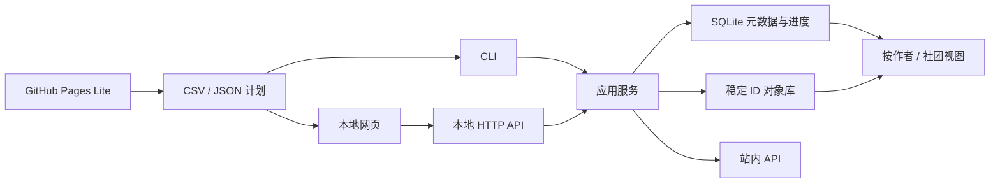

# 架构

Pica Library 是一个模块化单体：同一套领域模型服务 Lite 网页、本地网页与 CLI，避免三套功能逐渐分叉。

## 层次

- `src/sdk.ts`：站内登录、分页、搜索、章节、图片与可靠文件传输。
- `src/library/author.ts`：无损规范化与可解释的作者候选证据。
- `src/library/database.ts`：SQLite 数据模型、收藏快照、作者关系和图片状态。
- `src/library/service.ts`：同步、发现、排序与增量下载用例。
- `src/library/organizer.ts`：从稳定对象库生成按作者/社团浏览视图。
- `src/library/server.ts`：只监听本机的 JSON API 和静态网页服务。
- `src/library-cli.ts`：批处理与自动化入口。
- `web/`：同一套 Lite/完整版界面；Lite 数据只写入浏览器 IndexedDB。

## 数据原则

漫画、章节和图片以站内稳定 ID 为主键。显示名称可以改变，但不会导致重复对象。收藏同步是完整快照；目录中的旧收藏不会删除，只把 `is_favorite` 改为 false。下载先写 `.part` 文件，再原子改名，并记录字节数与 SHA-256。

作者归一分两步：确定性规则先生成候选，人工审核再做高风险合并。系统不会因为两个名字“看起来相似”就自动合并，从而避免同名作者被错误归档。

## 扩展点

后续版本可以在不改变 CLI/UI 的情况下替换推荐评分、加入外部作者词典、增加下载任务队列，或增加只读的 OPDS/阅读器接口。SQLite 与导出 JSON 都带稳定字段，便于迁移。
