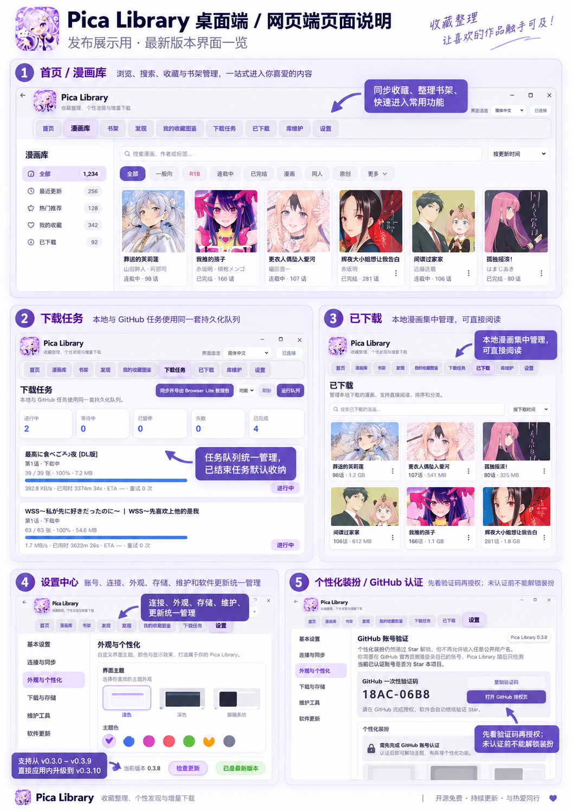

# Pica Library Desktop / Web Guide

> Windows Desktop / local Web UI. Current formal release: **v0.3.11 / Alpha8.11**.

## Install and start

1. Download `Pica-Library-v0.3.11-windows-x64.zip` from the [v0.3.11 release](https://github.com/Saber-Alter-Lily/pica-library/releases/tag/v0.3.11).
2. Extract the full ZIP and run `Pica Library.exe`.
3. A versioned usage notice is shown on first launch.
4. Configure your Pica account, optional proxy, and library folder as needed.

## Main areas

- **Home** — status and common entry points.
- **Library** — search and filter synchronized favorites and local comics.
- **Shelves** — organize titles into your own groups.
- **Discover** — recommendations and discovery views.
- **Favorite Atlas** — personal collection-oriented views.
- **Downloads** — persistent queue; finished/cancelled jobs are collapsed by default.
- **Downloaded** — manage and read local downloaded comics.
- **Settings** — account, connections, appearance, storage, maintenance, and updates.

## Downloads and local reading

Download jobs are persisted across restarts. Completed and cancelled history is collapsed by default while failures remain visible for recovery.

A paired Android device can read comics already downloaded by Desktop without downloading the same content again on the phone.

## Settings hub

Settings are grouped into General, Connections & Sync, Appearance & Personalization, Downloads & Storage, Maintenance, and Software Update.

## Pair Android

When phone and PC are on the same LAN, enable the mobile bridge on Desktop and finish pairing from **Android → Connect → Manage connection**. A paired phone can access local covers and downloaded content, sync selected state and theme packs, and use WebDAV as an optional fallback when Desktop is unavailable.

## Personalization

Desktop can import `.pica-theme` packs and sync available packs to Android. If a theme action requires additional verification, follow the prompt shown inside the app.

Desktop and Android keep their **active theme selections independently**.

## Updates

Prefer **Settings → Software Update**. The v0.3.11 universal incremental package is intended for direct upgrades from formal v0.3.x releases through v0.3.10; the release gate verifies source-package compatibility before publication.

## Data and safety

Pica Library is a local-first personal content-management tool. It does not sell, host, or redistribute manga content. Windows credentials are protected with DPAPI for the current Windows user, and official releases publish integrity/transparency metadata.

See [DISCLAIMER.md](../DISCLAIMER.md) for the full usage notice.

---

[Back to README](../README.en.md) · [Android guide](android-guide.en.md)
