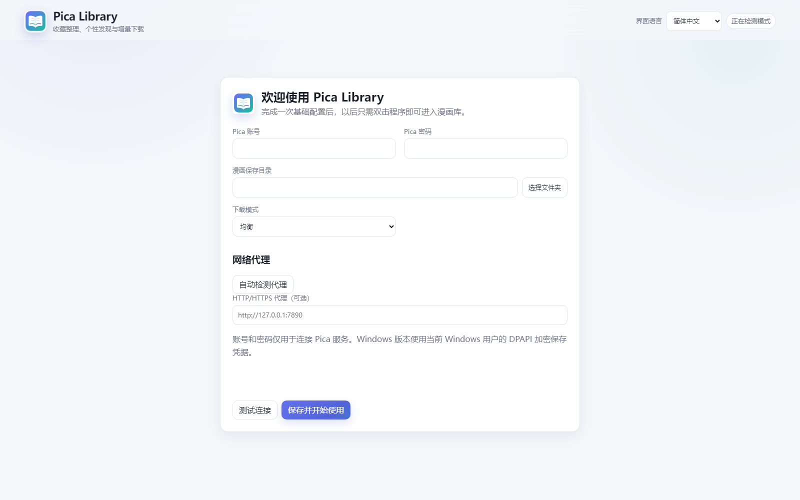

# Pica Library quick start

## 01 Download and extract

Download `Pica-Library-v0.3.0-windows-x64.zip` from
[GitHub Releases](https://github.com/Saber-Alter-Lily/pica-library/releases),
then extract the complete archive to a normal folder.

## 02 First launch

Double-click `Pica Library.exe`. The welcome page opens in your browser.

<!-- CAPTION_PENDING -->

## 03 Account and network

Enter the Pica account and password, choose the library folder, and add an
HTTP/HTTPS proxy only when your network requires one. Test the connection and save.

## 04 Sync favorites

Start the first favorites sync to build the local library.

## 05 Use the library

Search and filter the library, explore recommendations, manage downloads, and
continue reading downloaded chapters.

## 06 Update later

From v0.2.0, open **Maintenance → Software update → Check and update now**.
Users of v0.1.x should download a new full Windows ZIP.
