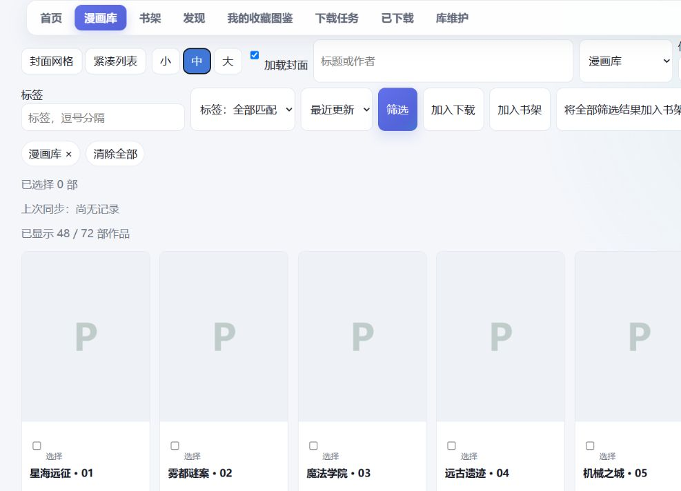
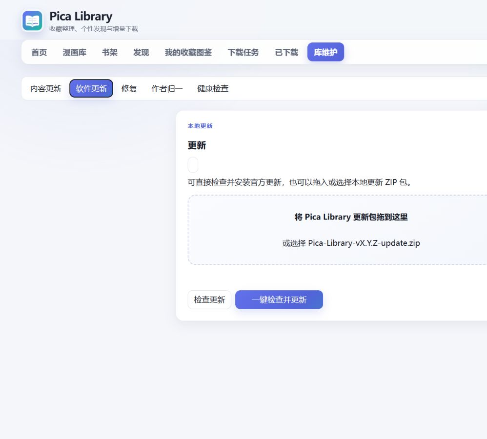

# Pica Library 快速开始

这份指南面向第一次使用 Windows 版的用户。完整操作通常只需几分钟。

## 01 下载与解压

从 [GitHub Releases](https://github.com/Saber-Alter-Lily/pica-library/releases) 下载
`Pica-Library-v0.3.0-windows-x64.zip`，然后完整解压到普通文件夹。不要直接在压缩软件中运行。

## 02 第一次启动

双击 `Pica Library.exe`。首次启动会在浏览器中打开欢迎页；未签名的开源程序可能触发 Windows SmartScreen 提示。

<!-- CAPTION_PENDING -->

## 03 完成账号与网络设置

填写 Pica 账号和密码，选择漫画保存目录。只有当前网络无法连接 Pica 时才填写 HTTP/HTTPS 代理。点击连接检查并保存；凭据会由 Windows DPAPI 加密。

## 04 同步收藏

连接成功后点击同步收藏。首次同步建立本地漫画库，之后可使用快速同步检查变化。

## 05 开始使用

- **漫画库：**搜索、筛选、放入书架。
- **推荐：**查看理由，换一批或重新生成。
- **下载：**加入队列，查看进度、暂停、继续或重试。
- **阅读：**从已下载内容继续阅读。

<!-- CAPTION_PENDING -->

## 06 后续软件更新

从 v0.2.0 起，打开 **Maintenance → 软件更新 → 一键检查并更新**。应用会下载、校验、安装兼容的官方增量包；v0.1.x 用户请重新下载完整 ZIP。

<!-- CAPTION_PENDING -->

应用文件与数据目录彼此独立。更新应用不会删除本地数据库、收藏或已下载漫画。
