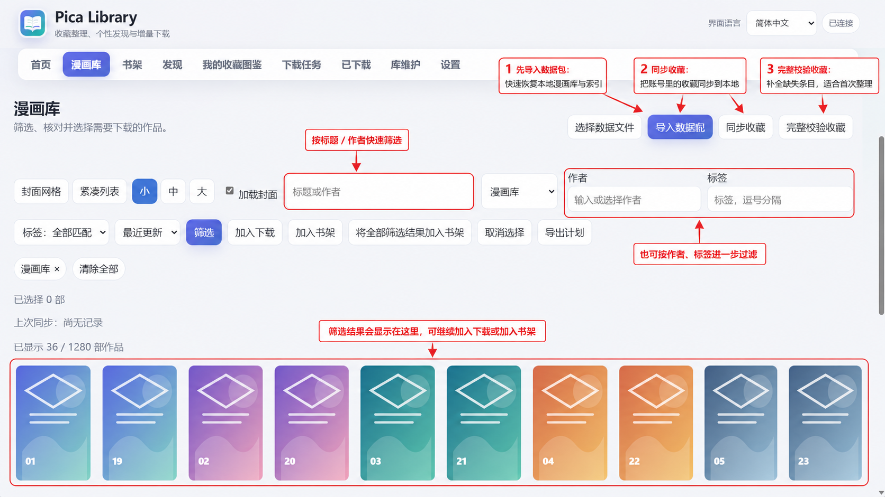
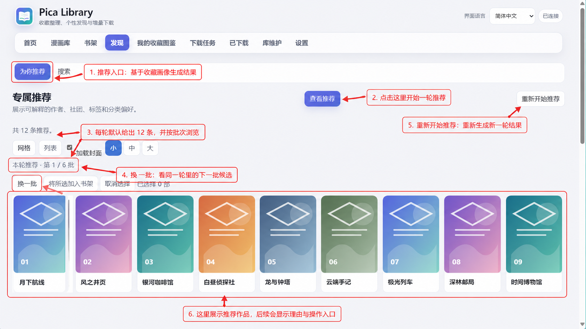
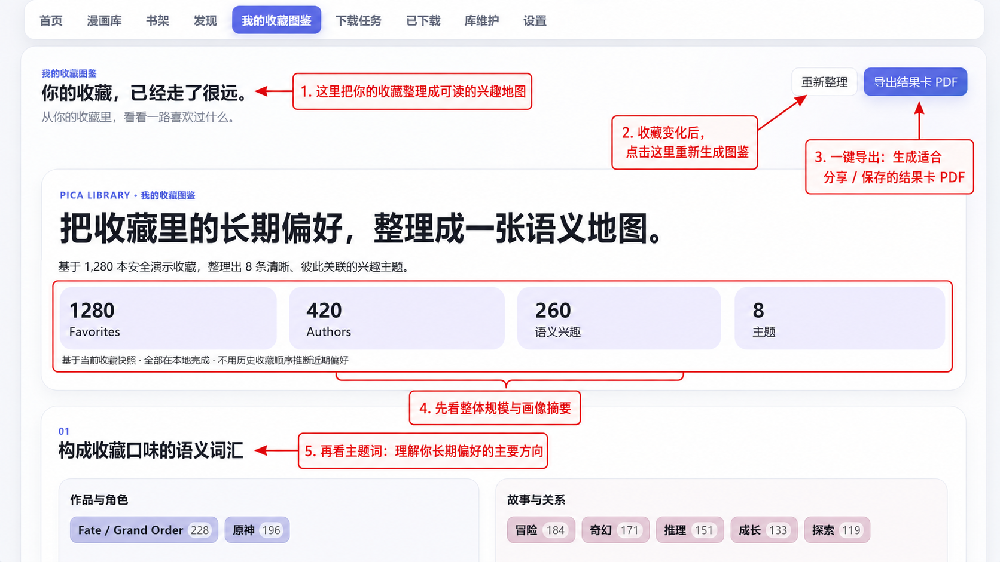
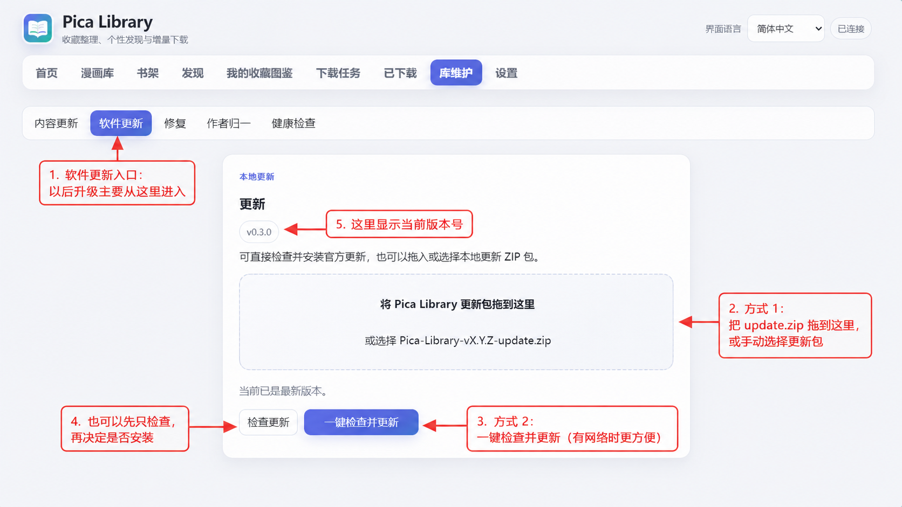

# Pica Library 快速开始

第一次使用 Windows 版通常只需几分钟。

## 01 下载与解压

从 [GitHub Releases](https://github.com/Saber-Alter-Lily/pica-library/releases/latest) 下载当前稳定版 Windows 完整包；v0.4.3 对应 `Pica-Library-v0.4.3-windows-x64.zip`。完整解压到普通文件夹，不要直接在压缩软件中运行。

## 02 第一次启动

双击 `Pica Library.exe`。首次启动会在浏览器中打开欢迎页；未签名的开源程序可能触发 Windows SmartScreen 提示。

填写 Pica 账号和密码，选择保存目录。只有当前网络无法连接 Pica 时才填写 HTTP/HTTPS 代理。连接检查通过后保存即可。

## 03 同步收藏并建立本地漫画库

首次使用先同步收藏，之后可以使用快速同步检查变化。漫画库支持标题、作者、标签、分类和书架筛选。

## 04 使用推荐和收藏图鉴

推荐页根据本地收藏画像生成分批推荐；收藏图鉴则把长期收藏整理成作品/IP、作者和语义兴趣地图。

## 05 下载与阅读

把作品加入下载任务后可以查看进度、暂停、继续或重试；下载完成后可使用内置 Web Reader 继续阅读。

## 06 后续软件更新

打开 **设置 → 软件更新 → 检查并更新（兼容时自动）**。

- 如果目标版本支持安全增量更新，程序会自动下载、校验、重启并应用。
- v0.4.1 / v0.4.2 → v0.4.3 属于兼容增量更新，可直接在软件内完成；如果仍为 v0.4.0，则使用 Release 中的 `Pica-Library-v0.4.3-upgrade-assistant.zip` 直接跨代升级。
- 升级助手会校验官方完整包、保护 `%LOCALAPPDATA%\\Pica Library`、备份旧程序和数据库并在失败时回滚；不需要卸载或重新导入数据。
- 如果不使用助手，仍可按页面提示手动退出旧版并替换程序目录。

应用文件与数据目录彼此独立；数据库、收藏、书架、历史、设置和已下载内容不会因为替换程序目录而被删除。
